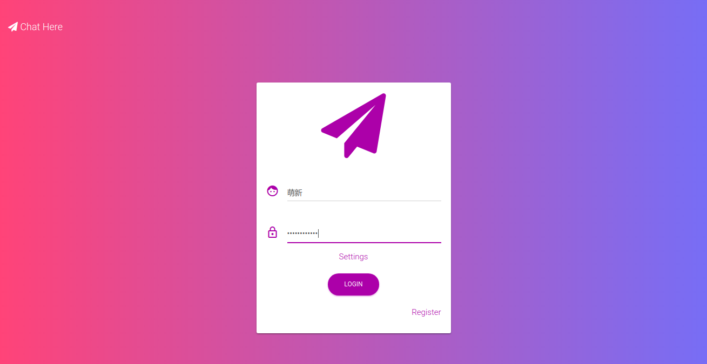
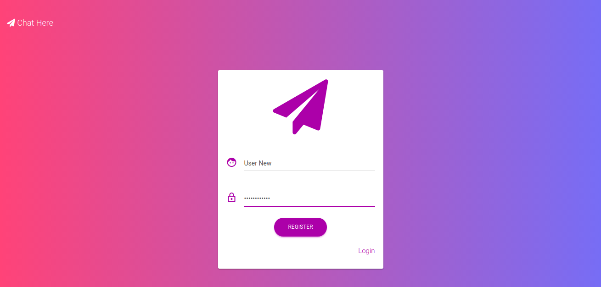
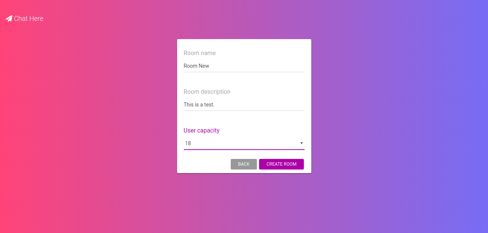
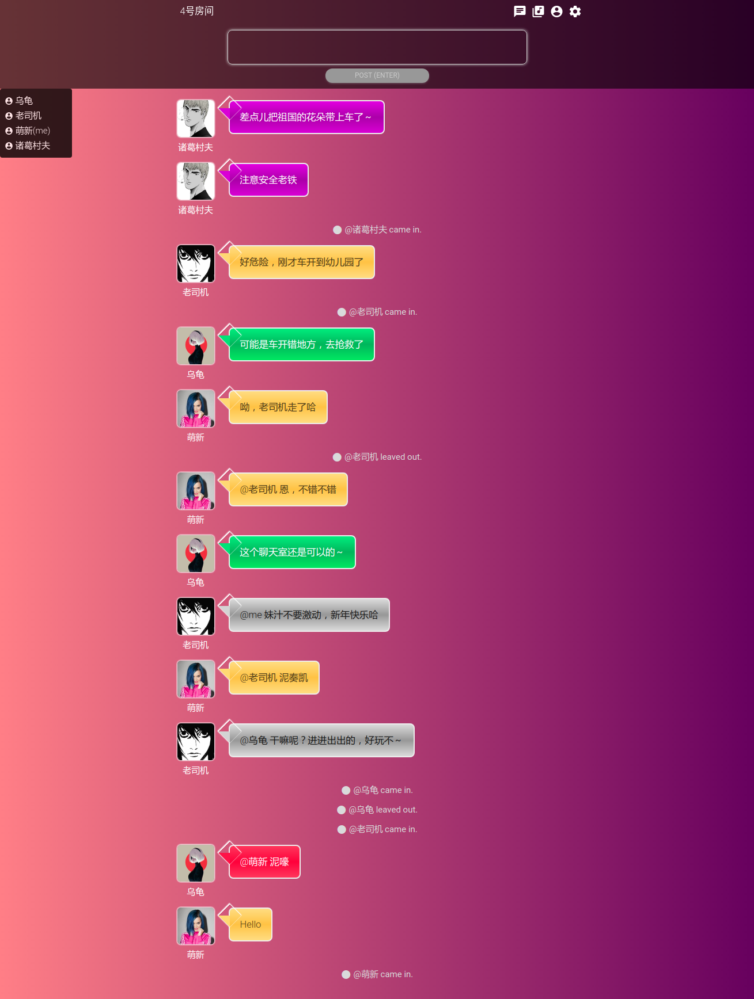
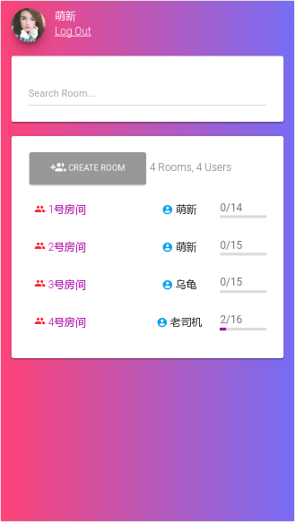

# chat-here

基于 Laravel 5.4 和 GatewayWorker 3.0 的响应式聊天室。

运行[截图](#截图)在最后。

## 框架/库/插件

* GatewayWorker: https://github.com/walkor/GatewayWorker
* Laravel: https://laravel.com
* Material-Icons: https://material.io/icons
* Font-Awesome: http://fontawesome.io
* Material-Kit: https://www.creative-tim.com/product/material-kit
* Bootstrap: https://getbootstrap.com
* skPlayer: https://github.com/wangpengfei15975/skPlayer

## 环境/工具

* LAMP (Ubuntu17.10 + Apache2 + MySQL + PHP5.6)
* Bash
* Sublime Text 3: https://www.sublimetext.com
* phpmyadmin: https://www.phpmyadmin.net
* GitKraken: https://www.gitkraken.com
* Composer: https://getcomposer.org

## 特性

* 多用户/多房间
* 用户注册/登录
* 房间列表/创建
* 公聊/私聊
* 断线自动重连
* 播放网易云音乐歌单/自定义音乐url

## 安装

1、克隆到本地

```
git clone https://github.com/mingcw/chat-here.git

```

2、安装依赖

```
composer install
```

3、准备数据库

```
mysql -u your_name -p
<Enter password>
mysql>create database `chat-here`;
mysql>exit;
```

4、配置`.env`

(a) 复制出`.env`文件

```
cp .env.example .env
```

(b) 配置`.env`的以下字段


```
APP_NAME='Chat Here'
...
APP_URL=your_virtual_host
...
DB_CONNECTION=mysql
DB_HOST=127.0.0.1
DB_PORT=3306
DB_DATABASE='chat-here'
DB_USERNAME=your_name
DB_PASSWORD=your_password
```

(c) 生成`APP_KEY`


```
php artisan key:generate
```

5、数据库迁移

```
php artisan migrate
```

6、数据填充

```
php srtisan db:seed
```

7、目录权限

```
chmod -R 0777 storage/
```

（仅针对 Linux 用户）

8、启动 GatewayWorker

```
cd gatewayworker/
composer install
php start.php start -d
```

停止 GatewayWorker：`php start.php stop`

注意，Windows 环境（不支持`php start.php {start|stop|restart|reload|status|connections} [-d]`的命令格式）请双击 `gatewayworker`目录下的`start_for_win.bat`启动，`ctrl+c`停止。

更多 GatewayWorker 相关，请参考[文档](http://doc2.workerman.net/326102)。

9、浏览器访问 http://your_virtual_host

## 测试账号

请使用**多个**浏览器测试（或浏览器新开**隐私模式**）

账号 | 密码
--- | ---
萌新 | user11111111
乌龟 | user11111111
老司机 | user11111111

## 截图

<p></p>
<p></p>
<p></p>
<p></p>
<p></p>
<p></p>
<p></p>

## 说明

目录音乐播放器使用已封装好的 HTML5 插件，部分网易云音乐的歌单能拉取出来，但无法播放。

## 协议

[MIT](./LICENSE)
